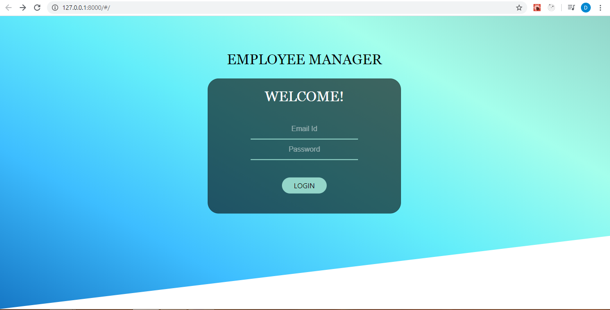
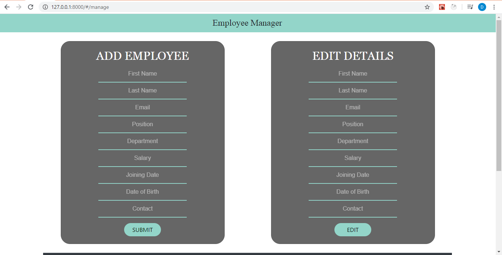
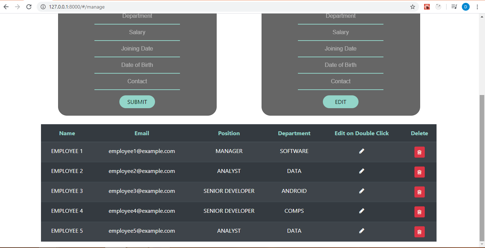

This site deals with CRUD operation using Django-rest-framework for creating api and uses Django for backend ; ReactJS for frontend.
However, token authentication is not included in the project. But a frontend for login page is made to enter login details (any details)
which is the routed to manager page which allows crud operations to be performed.

To clone and run the site, "npm install" is necessary to install the node module dependencies included in the project.
Also "pip install django djangorestframework django-rest-knox" is required to  setup django environment.

A virtual environment is setup  using "virtualenv" command. 

After setting up the project, run the server by  changing the directory to Employee\employee_backend\src and then run the command -
"python manage.py runserver"
Also run the command -" npm run dev " to get react  integrated and reflect the changes in the frontend.
sqlite database is used for the concerned operations.

